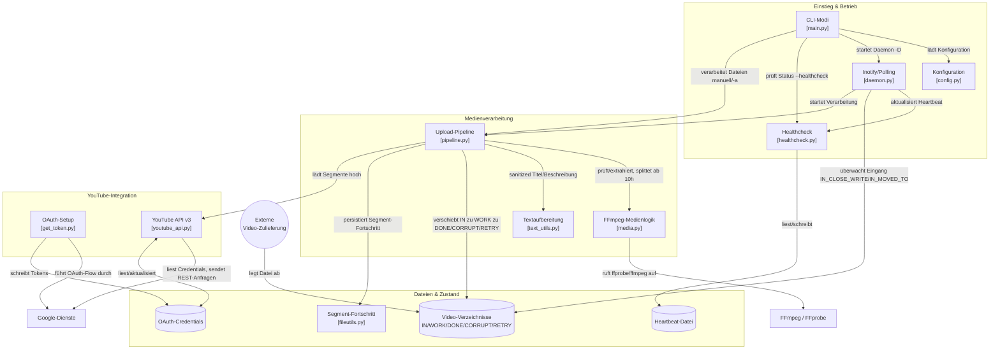

# 🏗️ Architektur

Dieses Dokument beschreibt den Aufbau von `yt-upload` auf Modulebene: welche Komponente was tut und wie Dateien, Konfiguration und externe Dienste (FFmpeg, YouTube/Google) zusammenspielen. Für Betriebsanleitungen (Docker, CLI-Flags, `upload.conf`) siehe [README.md](README.md); für Entwicklungs-Konventionen (Test-Fixtures, Config-Precedence-Pattern) siehe [CLAUDE.md](CLAUDE.md).

## Überblick

## Komponenten

### Einstieg & Betrieb

- **`main.py`** — argparse-CLI, drei sich gegenseitig ausschließende Modi: manuelle Datei(en) (`yt-upload video1.mp4 ...`), Auto-Batch (`-a`, verarbeitet `IN_DIR` einmalig), Dämon (`-D`, dauerhafter inotify-Watch). `_resolve_file_args()` erzeugt pro Datei eine eigene `argparse.Namespace`-Kopie, damit die `--title-template`-Nummerierung bei mehreren Dateien nicht das gemeinsame `args`-Objekt mutiert.
- **`config.py`** — alle Laufzeit-Einstellungen liegen als Modul-globale Variablen, geladen von `load_configuration()` mit der Prioritätskette Hardcoded-Defaults → `/etc/yt-upload/upload.conf` → `conf.d/*.conf` → Umgebungsvariablen (höchste Priorität). Andere Module referenzieren Werte immer als `config.NAME` (nie `from yt_upload.config import NAME`), damit ein späteres Hot-Reload durch `load_configuration()` auch tatsächlich ankommt. Container- vs. Bare-Metal-Defaults werden über `os.path.exists("/app/oauth")` / `os.path.exists("/videos")` unterschieden.
- **`daemon.py`** — inotify-basierter Watch (ausschließlich `IN_CLOSE_WRITE`/`IN_MOVED_TO`, um eine sich selbst befeuernde Event-Schleife durch die eigenen Verzeichnis-Scans zu vermeiden) mit Polling-Fallback, falls das `inotify`-Paket fehlt, plus ein `flock`-basierter Single-Instance-Lock (`acquire_instance_lock()`).
- **`healthcheck.py`** — `write_heartbeat()` aktualisiert regelmäßig (auch innerhalb langer Einzeloperationen wie einem mehrstündigen Resumable-Upload) eine Heartbeat-Datei; `run_healthcheck()` prüft nur deren Existenz/Alter, lädt bewusst keine Config und ist damit für häufige externe Aufrufe (Docker `HEALTHCHECK`) geeignet.

### Medienverarbeitung

- **`pipeline.py`** — `process_single_file()` ist die Zustandsmaschine pro Datei: validieren → nach `WORK_DIR` verschieben → Metadaten/Thumbnail extrahieren → bei >10h splitten → jedes Segment hochladen → nach `DONE_DIR`/`CORRUPT_DIR`/`RETRY_DIR` verschieben. Die Funktion wirft bei einem Upload-Fehler **nie** eine Exception — sie routet die Datei intern selbst und kehrt zurück —, weshalb sowohl Auto-Batch als auch der Multi-Datei-CLI-Modus ohne eigenes try/except über Dateien iterieren können.
- **`media.py`** — sämtliche `ffprobe`/`ffmpeg`-Aufrufe: Metadaten-/Thumbnail-Extraktion, Bereitschaftsprüfung (Datei wird noch geschrieben?) und verlustfreies Splitting per Stream-Copy-Segmentierung oberhalb von `SEGMENT_TIME_SEC` (10h).
- **`text_utils.py`** — Sanitizing für die API, Mapping YouTube-Kategoriename → ID, sowie der Beschreibungs-Blacklist-Zensor.

### YouTube-Integration

- **`youtube_api.py`** — handgeschriebener Resumable-Upload direkt gegen die YouTube-Data-API-v3-REST-Endpunkte (ohne `google-api-python-client`). Jeder Einstiegspunkt (`get_access_token`, `upload_single_video`, `add_video_to_playlist`) nimmt optional einen `cred_file`/`client_secrets_file`-Override entgegen — die API-seitige Grundlage für spätere Mehr-Kanal-Unterstützung existiert also bereits (siehe Backlog in [CLAUDE.md](CLAUDE.md)).
- **`get_token.py`** (Package `get_token`, eigener Einstiegspunkt `get-token`) — eigenständiges, einmaliges OAuth-Setup-Skript. Es importiert bewusst **nicht** aus `yt_upload` (Docker kopiert die Datei als eigenständiges Skript nach `/usr/local/bin/get_token`, unabhängig vom pip-Package), weshalb gemeinsame Logik wie die `client_secrets.json`-Parsing-Präzedenz absichtlich dupliziert ist — mit Kommentar-Verweis auf das `yt_upload`-Gegenstück (`youtube_api.get_access_token()`), mit dem sie synchron gehalten werden muss.

### Dateien & Zustand

- **`fileutils.py`** — Ziel-Pfad-Auflösung (`ALLOW_OVERWRITE` vs. `unique_path()`) sowie das Segment-Fortschritts-JSON-Sidecar (`.{filename}.progress.json`), das einem fehlgeschlagenen Multi-Segment-Upload erlaubt, ohne erneuten Upload bereits erfolgreicher Segmente fortzusetzen. Aus demselben Grund sind `RETRY_DIR` und `CORRUPT_DIR` getrennt: eine Datei landet nur dann in `CORRUPT_DIR`, wenn *kein einziges* Segment erfolgreich war.
- **Video-Verzeichnisse** (`IN_DIR`/`WORK_DIR`/`DONE_DIR`/`CORRUPT_DIR`/`RETRY_DIR`) — der Dateisystem-Zustand, entlang dessen `pipeline.py` jede Datei bewegt; Pfade kommen aus `config.py` (siehe [README.md](README.md#-verzeichnisstruktur-im-container)).
- **OAuth-Credentials** — von `get_token.py` per interaktivem Flow erzeugt, von `youtube_api.py` gelesen und (Token-Refresh) aktualisiert.
- **Heartbeat-Datei** — von `healthcheck.py` geschrieben/gelesen, Grundlage für `--healthcheck` und Docker/Kubernetes-Liveness-Probes.

## Config/CLI-Präzedenz-Pattern

Die meisten Pro-Upload-Einstellungen (Titel, Beschreibung, Kategorie, Privacy, Embeddable, …) folgen in `pipeline.py` derselben Override-Kette: expliziter CLI-Parameter → aus dem Container extrahierte Metadaten (ffprobe-Tags) → `config.py`-Default (`args.x if ... else meta[...] or config.X`). Neue überschreibbare Einstellungen sollten diesem Muster folgen statt ein neues zu erfinden.
